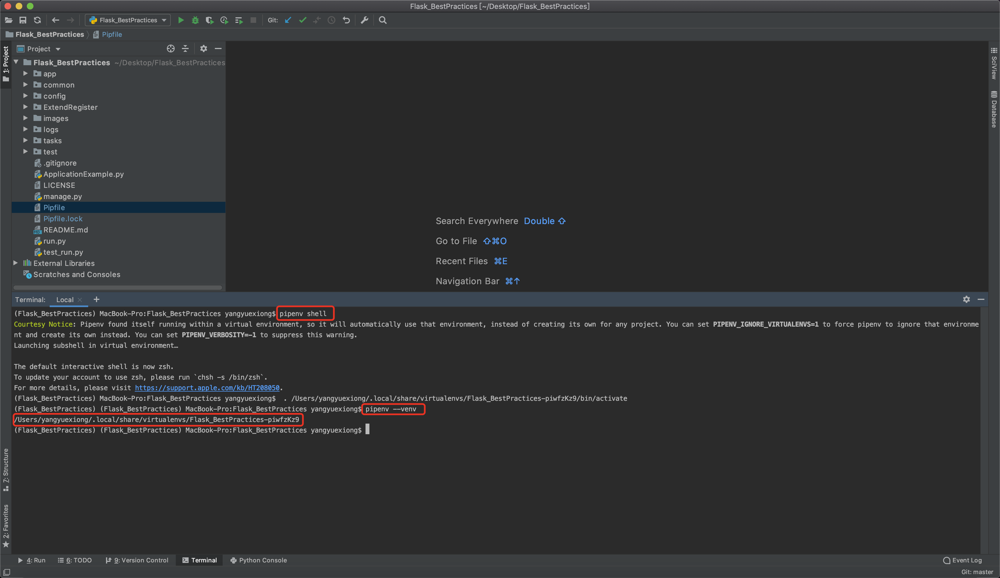
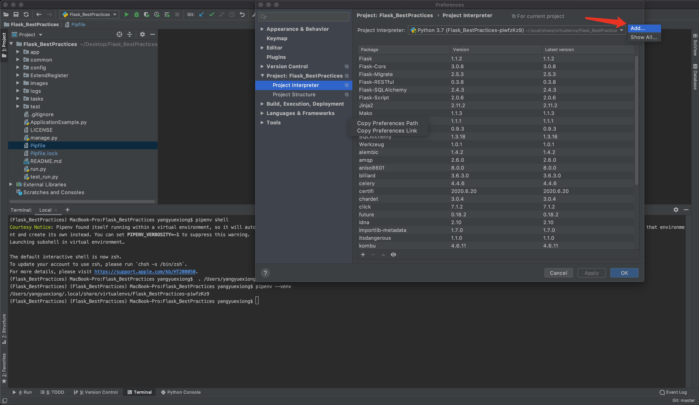
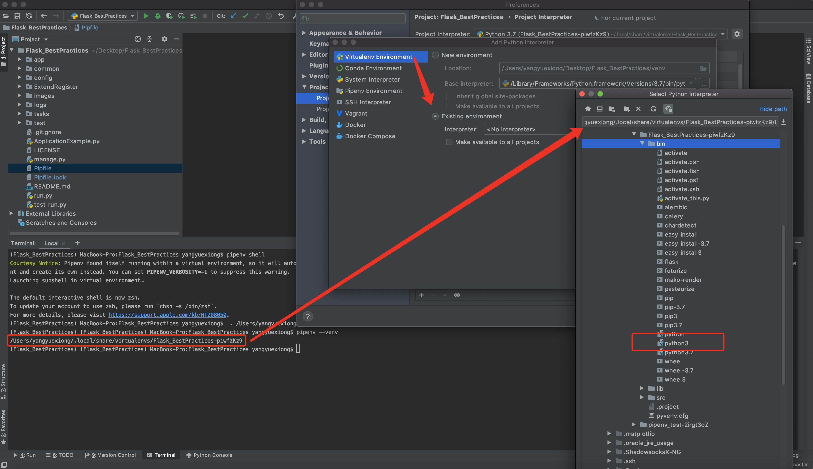
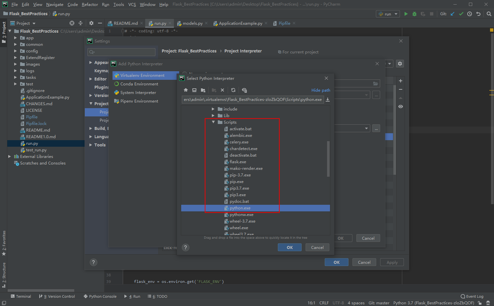
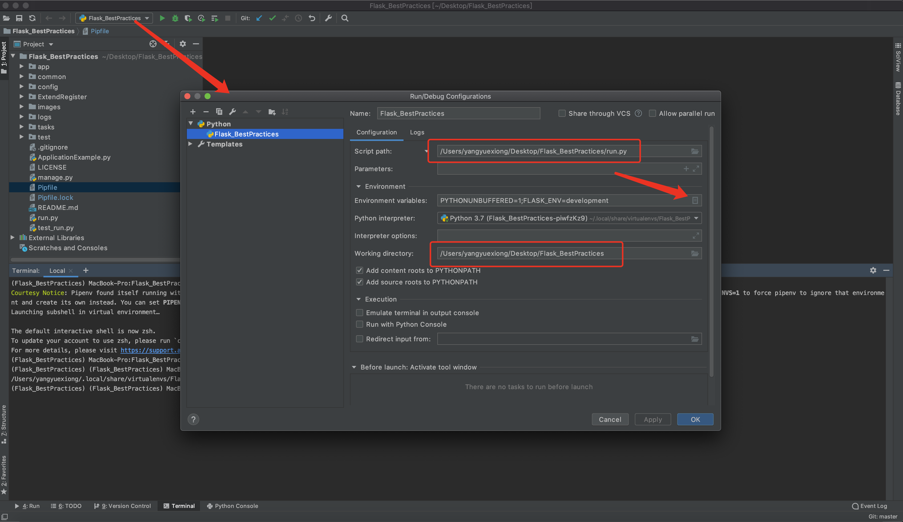
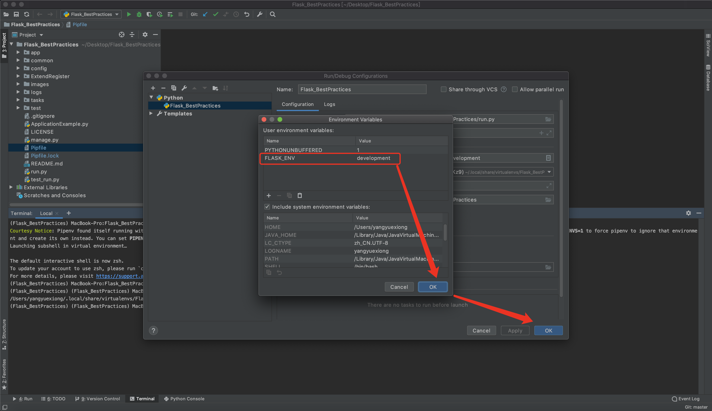
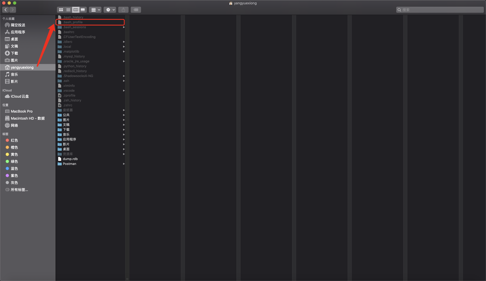
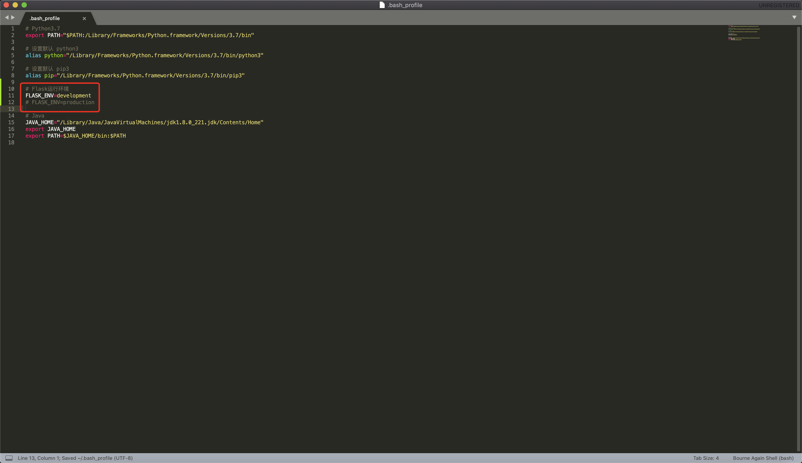

# Flask_BestPractices

## Flask 最佳实践

> ---------->>>>>>持续更新<<<<<<----------
>
> - [更新日志](./CHANGES.md)
>
> - [Flask_BestPractices v1.0 README](./README1.0.md)
>
> 这是一个项目结构,可以直接使用并开始编写业务
>
> 包含前后端分离 Result Api 以及 不分离 Jinja2 模版渲染
>
> 以下使用此结构加上 Vue 与 React 实现一套前后分离的电商前后台
>
> Web端: https://github.com/yangyuexiong
>
> C端Server: https://github.com/yangyuexiong
>
> 后台Server: https://github.com/yangyuexiong/EC_project
>
> Aiohttp 最佳实践: https://github.com/yangyuexiong/AioHttp_BestPractices
>
> 可能会再出 Tornado,Sanic,FastApi,Aiohttp 等最佳实践
>
> 大佬们！下面简陋的文档凑合先看着,有空闲时间补上详细使用文档
>
> 如有疑问 -> QQ or Wechat : 417993207 (使用遇到问题请马上联系我会及时为你解答)
>
> **你不点 Star 我更新给谁看?**
>
> **Github**:
>
> https://github.com/yangyuexiong/Flask_BestPractices
>
> **码云**:
>
> https://gitee.com/yangyuexiong/Flask_BestPractices
>
> **Flask 官方文档**
>
> https://flask.palletsprojects.com/
>
> **Flask 中文文档**
>
> https://dormousehole.readthedocs.io/en/latest/
>
> ---------->>>>>>感谢支持<<<<<<----------

```text
Flask_BestPractices
├── app(应用)
│   ├── __init__.py
│   ├── all_reference.py(通用统一导入)
│   ├── api
│   │   ├── __init__.py(注册url)
│   │   ├── method_view_demo(MethodView使用例子)
│   │   │   ├── __init__.py
│   │   │   └── method_view_demo.py
│   │   ├── restful_demo(flask_restful使用例子)
│   │   │   ├── __init__.py
│   │   │   └── restful_demo.py
│   │   └── route_demo(flask路由使用例子)
│   │       ├── __init__.py
│   │       └── route_demo.py
│   ├── controllers(其他业务)
│   │   ├── __init__.py
│   │   ├── other_module_01
│   │   │   ├── __init__.py
│   │   │   └── module_01.py
│   │   ├── other_module_02
│   │   │   ├── __init__.py
│   │   │   └── module_02.py
│   │   └── other_module_03
│   │       ├── __init__.py
│   │       └── module_03.py
│   ├── models(模型)
│   │   ├── __init__.py
│   │   └── admin
│   │       └── models.py
│   ├── static(静态文件(Js,Css,Img))
│   │   ├── flask.jpg
│   │   └── images
│   │       └── flask.jpg
│   └── templates(模版文件(HTML)用于模版渲染(前后分离不需要,这里只作为一个例子))
│       ├── index01.html
│       ├── index02.html
│       └── index03.html
├── common(公共文件分类)
│   ├── __init__.py
│   ├── interceptors(路由钩子)
│   │   ├── ApiHook.py(前台应用拦截处理器(即:访问api开头的url时做的逻辑处理))
│   │   ├── AppHook.py
│   │   ├── CmsHook.py(管理后台拦截处理器(即:访问cms开头的url时做的逻辑处理))
│   │   └── __init__.py
│   └── libs
│       ├── BaseModel.py(ORM基类)
│       ├── __init__.py
│       ├── api_result.py(统一返回json格式规范)
│       ├── customException.py(自定义异常)
│       └── tools.py(工具)
├── config(配置文件)
│   ├── __init__.py
│   ├── config.py
│   ├── dev.ini
│   └── pro.ini
├── ExtendRegister(扩展统一注册)
│   ├── __init__.py
│   ├── bp_register.py(蓝图)
│   ├── command_register.py(flask shell 注册)
│   ├── conf_register.py(配置文件)
│   ├── db_register.py(数据库)
│   ├── excep_register.py(异常处理)
│   ├── hook_register.py(路由钩子拦截器)
│   └── model_register.py(模型统一导入用于迁移)
├── logs
│   ├── __init__.py
│   └── tb.log
├── migrations(数据迁移文件(会在初始化迁移环境后生成))
├── tasks(定时任务/异步任务)
│   ├── APSchedulerTasks
│   │   └── clear_logs.py
│   ├── CeleryAsyncTasks
│   │   ├── __init__.py
│   │   ├── celeryconfig.py
│   │   └── main.py
│   └── __init__.py
├── test(测试)
│   ├── __init__.py
│   ├── excep_test.py
│   ├── req_test.py
│   ├── test_celery.py
│   ├── test_data.py
│   └── test_env.py
├── ApplicationExample.py(应用实例)
├── LICENSE
├── Pipfile(环境依赖)
├── Pipfile.lock
├── README.md
├── run.py(启动文件)
└── test_run.py(调试启动文件(可以忽略或者删除))

```

## 一、安装

- Python3.7 ～ 3.9
- pip3
- pipenv

  ```shell script
  pip3 install pipenv
  ```

## 二、配置虚拟环境

- 进入项目根目录

  ```shell script
  cd /Flask_BestPractices
  ```

- 修改 pipenv 的 pip 安装源(科学上网(翻墙)的同学可以忽略)

  - [Pipfile](./Pipfile)

  ```
  Pipfile 文件修改如下:

  # 国内pip安装源(不能翻墙的同学修改如下,在可以翻墙的情况下依旧国内pip源比较快)
  url = "https://mirrors.aliyun.com/pypi/simple"

  # 国外pip安装源(可以翻墙)
  url = "https://pypi.org/simple"

  # 修改对应的 Python 版本
  [requires]
  python_version = "3.9"
  ```

- 安装虚拟环境与依赖的包

  ```shell script
  pipenv install
  ```

- 进入虚拟环境

  ```shell script
  pipenv shell
  ```

- 查看虚拟环境路径

  ```shell script
  pipenv --venv
  ```

  

- Pycharm 配置 pipenv 虚拟环境(不使用 Pycharm 的同学可以忽略)

  
  
- Mac 
  
  
- Windows
  

- 配置 Pycharm 的 Flask 变量(因为 Pycharm 运行项目不会读取系统变量所以要配置在 Pycharm 中)

  
  

- 配置 Flask 系统变量(原本操作系统中并没有 FLASK_ENV 变量,所以 Flask 启动的时候默认为 production,为了区分开发/生产需要通过以下方式配置)(以下配置只能在终端启动项目生效在 Pycharm 不生效)

- Windows 系统(一般用于开发环境,所有配置为开发的变量:development)

  

- MacOS 系统(同样也配置为开发环境,所有配置为开发的变量:development)

  ```shell script
  vim ~/.bash_profile
  ```

  

  ```
  打开文件找到(如果没看到这个文件 按: shift按键+command按键+ . 按键。就会显示隐藏文件因为隐藏文件一般不显示/需要使其隐藏,再按一次 shift按键+command按键+ . 按键)
  ```

  

  ```shell script
  生效配置文件
  source ~/.bash_profile
  ```

- Linux 系统(一般使用为生产环境,所有配置为生产的变量:production)
  ```shell script
  vim ~/.bashrc
  ```
  
  ```shell script
  source ~/.bashrc
  ```

## 三、配置文件

- [config.py](./config/config.py) 第 14 行

  - project_name = '你的项目名称'

- 前置准备(如:创建数据库)

  - [/config/dev.ini](./config/dev.ini)
  - [/config/pro.ini](./config/pro.ini)

## 四、ORM

- 这里我提供了一套简单的后台权限管理,用于测试数据迁移

- [command_register.py](./ExtendRegister/command_register.py) 文件中注册 flask-cli 当前已经定义好初始化数据,创建表等方法

  ```shell script
  pipenv shell
  ```

  windows

  ```shell script
  set FLASK_APP=ApplicationExample.py
  ```

  mac/linux

  ```shell script
  export FLASK_APP=ApplicationExample.py
  ```

  ```shell script
  flask
  ```

- 首次!首次!首次! 创建表时执行

  ```shell script
  pipenv shell
  ```

  windows

  ```shell script
  set FLASK_APP=ApplicationExample.py
  ```

  mac/linux

  ```shell script
  export FLASK_APP=ApplicationExample.py
  ```

  ```shell script
  flask orm
  ```

  或如下

  ```shell script
  flask db init
  flask db migrate
  flask db upgrade
  ```

- 每次！每次！每次！新增 model 在 [model_register.py](./ExtendRegister/model_register.py) 导入后执行

  windows

  ```shell script
  set FLASK_APP=ApplicationExample.py
  ```

  mac/linux

  ```shell script
  export FLASK_APP=ApplicationExample.py
  ```

  ```shell script
  flask table
  ```

  或如下

  ```shell script
  flask db migrate
  flask db upgrade
  ```

## 五、路由注册

- 创建(路由,Api,视图)

  - [restful_demo.py](./app/api/restful_demo/restful_demo.py)
  - [method_view_demo.py](./app/api/method_view_demo/method_view_demo.py)
  - [route_demo.py](./app/api/route_demo/route_demo.py)

- 路由注册

  - [/Flask_BestPractices/app/api/**init**.py](./app/api/__init__.py)

- 路由绑定应用

  - [/Flask_BestPractices/ExtendRegister/bp_register.py](./ExtendRegister/bp_register.py)

## 六、钩子函数(拦截器):

- 拿其中一个举例(业务逻辑根据自己需要编写)

  - [/Flask_BestPractices/common/interceptors/ApiHook.py](./common/interceptors/ApiHook.py)

## 七、自定义异常:

- 在 [customException.py](./common/libs/customException.py) 添加

  ```python

  # 在 custom_resp_dict 添加 kay:value
  custom_resp_dict = {
            333: '测试自定义异常',
            400: '参数类型错误',
            401: '未登录_认证信息失败_令牌过期',
            403: '无权限',
            500: '服务器异常',
            666: 'Token?',
            996: '没救了'
        }
  ```

- 使用

  ```python

    from common.libs.customException import method_view_ab_code as ab_code
    from common.libs.customException import flask_restful_ab_code as ab_code_2

    
    # flask_restful 使用 ab_code_2
    class FlaskRestfulCustomException(Resource):

        def get(self):
            ab_code_2(333)

    # MethodView 使用 ab_code
    class MethodViewCustomException(MethodView):

        def get(self):
            ab_code(333)
  ```

## 八、接口调用

- (注意在 url 末尾要加上'/'否则会出现 308 报错,或者在定义 url 时不在末尾加上'/')

- api:

  - http://0.0.0.0:9999/api/

- cms:

  - http://0.0.0.0:9999/cms/

- 其他业务模块:

  - http://0.0.0.0:9999/m1/
  - http://0.0.0.0:9999/m2/
  - http://0.0.0.0:9999/m3/

## 九、任务

- 异步任务

  ```
  注意:配置好redis,如果使用MQ等其他需要对应修改配置后在启动
  启动celery例子(必须要在/CeleryAsyncTasks目录下启动以及配置好redis):
      /CeleryAsyncTasks/main.py里面含有启动/停止等命令例子,模拟邮件发送任务例子.

  调用任务例子:
      启动后调用任务例子:
      调用任务例子: /test/test_celery.py
  ```

- 定时任务
  ```
  使用例子:
      /tasks/APSchedulerTasks/clear_log.py文件中包含3钟常用方法,以清除日子为例子
  启动:
      /APSchedulerTasks目录下直接执行clear_log.py文件
  ```

## 十、部署(2022-01-18 更新):

- 我掘金的一篇文章

  - 本机部署：https://juejin.cn/post/6844903870250876935
  - Docker部署：https://juejin.cn/post/7054460759526342687

## 备注
- 代码中可能存在大量打印调试代码语句(print('xxxx'))可以将其注释或者删除。

- 快试试快速实现你业务需求吧！！！嘻嘻！！！
